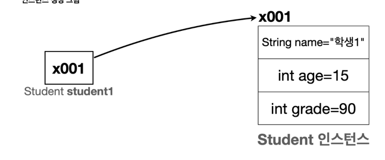

day1 : 클래스와 데이터<br>
day2 : 기본형과 참조형<br>
day3 : 객체 지향 프로그래밍, 생성자<br>
day4 : 패키지, 접근제어자, 파이널<br>
day5 : 자바 메모리 구조와 static<br>
day6 : 상속<br>
day7 : 다형성 , 다형성 설계<br>

### 클래스와 데이터
- 하나의 개념으로 묶기 위해서는 클래스로 묶고 해당 개념의 상세 데이터를 변수로 선언하는 것으로 해당 개념을 정의한다.
- Student.class를 만들어 학생이라는 개념을 만들고 필드 변수에 이름, 나이, 성정이라는 변수로 학생을 정의한다.
- 클래스는 하나의 설계도, 그 설계도로 만든 것이 하나의 인스턴스다.
- 이때 인스턴스는 주소값을 가지며 메모리를 할당받는다.
- 따라서 해당 인스턴스를 sysout하게 되면 주소값을 확인 할 수 있고 인스턴스를 통해서 필드변수에 접근할 수 있다.

- 위 내용을 코드로 정리 하면

```java
    String newInstance = new String("test"); //주소값이 x100이라고 가정
    newInstance.equals("test"); //== x100.equals("test"); 주소값으로 해당 변수,함수 접근 가능
```
#### 배열에 인스턴스를 입력하는 경우에는 어떻게 될까?
```java
    Student newInstance1 = new Student(); //주소값이 x100이라고 가정
    Student newInstance2 = new Student(); //주소값이 x200이라고 가정

    Student[] studentArray = new Strudent[2];
    studentArray[0] = newInstance1;
    studentArray[1] = newInstance2;
```

- 이때 studentArray[0].toString().equals(newInstance1) == true이다.
- 이뜻은 결국 배열에 데이터를 넣을때는 해당 새로운 인스턴스를 생성하는 것이 아닌 해당 주소값을 넣는다. 
<hr>
<ul>
    <li> 상속관계에서 overrding이 작동하는 순서</li>
    <li> 1번을 이용해서 어떻게 OCP를 적용하여 구현할 수 있는지.</li>
    <li> 전략패턴을 이용하면 OCP를 위반하지 않고 효율적인 구현이 가능하다.</li>
 </ul>

## 전략패턴
<hr>
<br>
핵심은 하나의 interface로 구현체를 만들고 클라이언트의 코드 수정없이(인스턴스를 변경하는 약간의 수정은 있을 수 있음) 기능을 변경할 수 있도록 만드는 패턴