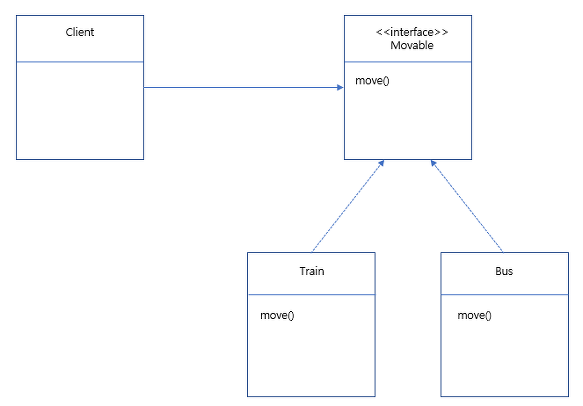

day1 : 클래스와 데이터 
day2 : 기본형과 참조형 
day3 : 객체 지향 프로그래밍, 생성자 
day4 : 패키지, 접근제어자, 파이널 
day5 : 자바 메모리 구조와 static 
day6 : 상속 
day7 : 다형성 , 다형성 설계 

## 알게 된점

<ul>
    <li> 상속관계에서 overrding이 작동하는 순서</li>
    <li> 1번을 이용해서 어떻게 OCP를 적용하여 구현할 수 있는지.</li>
    <li> 전략패턴을 이용하면 OCP를 위반하지 않고 효율적인 구현이 가능하다.</li>
 </ul>

## 전략패턴

 
핵심은 하나의 interface로 구현체를 만들고 클라이언트의 코드 수정없이(인스턴스를 변경하는 약간의 수정은 있을 수 있음) 기능을 변경할 수 있도록 만드는 패턴